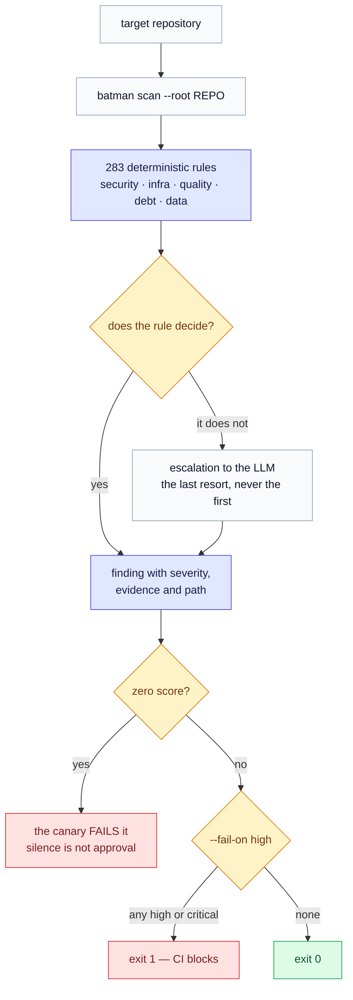
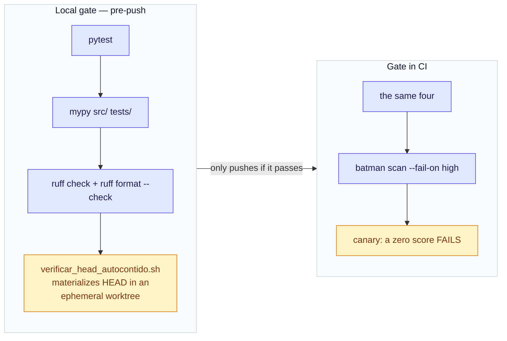

# Batman OS

[](https://github.com/rodrigogvieira98/batman-os/actions/workflows/ci.yml) [](LICENSE) 

**Engineering governance as an operating system.** 283 deterministic rules that audit an
entire repository — security, infrastructure, quality, technical debt, data — without
calling a language model. The LLM comes last, only when the deterministic rule cannot
decide.

🇧🇷 [Português](README.md) · 🇪🇸 [Español](README.es.md) · 🇺🇸 **English**

> "An intelligent system is not the one that answers every question. It is the one that
> continuously reduces the number of questions that need to be asked."

| | |
|---|---|
| **165+ commits**, single author | **1,500+ acceptance tests**, one per specification chapter |
| **283 rule specs** | `mypy --strict` and `ruff` clean, blocking in CI |
| **39 chapters** of specification written before the code | runs in production against a real product, every 5 minutes |

## Why this is not a linter

A linter answers *"is this line wrong?"*. Batman OS answers *"is this repository being
developed in a way that will fail?"* — and treats its own answer as something that might
be lying.



<sub>The LLM is the <b>last</b> step, never the first — and the canary runs before the exit code, because <code>0 findings</code> and <code>all clear</code> are indistinguishable.</sub>

Two real defects the project found **in itself**, and the defenses born from them:

**1. The gate could not see what was committed.** `pytest`, `mypy` and `ruff` run against
the *working tree*. A file imported by the code but never versioned passes all four — and
breaks on the first clean clone. It happened twice. The defense
(`scripts/verificar_head_autocontido.sh`) materializes HEAD in an ephemeral worktree and
requires `(types, specs)` to match the tree.

**2. "Zero findings" and "all clear" are indistinguishable.** A CI run enumerated 1,382
files, reported `0 finding(s)` and exited 0 — because the package shipped without the 283
specs, and `glob` over a nonexistent directory raises no error. A gate that only checks
the exit code would have gone green. The defense is a canary that **fails a zero score**:
silence stopped counting as approval.

That is the thesis of the whole project — **silent failure is the enemy**. A process that
hangs is worse than one that drops work, because dropped work shows up in the report and
hanging just looks like slowness.



## Architecture at a glance

```
docs/spec/       specification (39 chapters, 10 volumes, 17 ADRs) — wins over the code
                 on divergence, by explicit rule
src/batman_os/
  foundation/    official glossary types (Mission, Capability, Operator, ...)
  kernel/        Mission Runtime, Planning/Decision/Workflow Engine, Event Bus, Scheduler
  runtime/       Capability/Execution Engine, Operational Memory (SQLite), concurrency
  capabilities/  operators, certification, skills, tools — and the 283 migrated rules
  workflow/      formal missions, multi-step playbooks, recovery and fallback
  learning/      Knowledge Graph, rule/workflow evolution, operational learning
  governance/    Governance Engine, Human Review, LLM escalation, observability
  api/           HTTP API (FastAPI) — tenant derived from the key, never from the body
tests/           1 file per chapter, named after the specification's acceptance criteria
```

**Multi-tenant isolation is structural**, on both read and mutation — not a
`WHERE tenant_id` sprinkled across queries. The tenant applied to a Mission comes 100%
from the API key used; no endpoint accepts the tenant as a payload field.

## Running it

```bash
python3.11 -m venv .venv
pip install -e ".[dev]"

pytest                                      # acceptance tests
mypy src/
ruff check src/ tests/

batman scan --root <repo>                   # audit a real repository
batman scan --root <repo> --fail-on high    # exit 1 on high/critical findings
```

> The specification, documentation and comments are in Portuguese — the language the
> system was designed in. Code identifiers (classes, functions, variables) are in
> English. The [Portuguese README](README.md) carries the full detail: naming
> conventions, the HTTP API, and the CI gate.

---

<sub>MIT © 2026 Rodrigo Gomes Vieira</sub>
