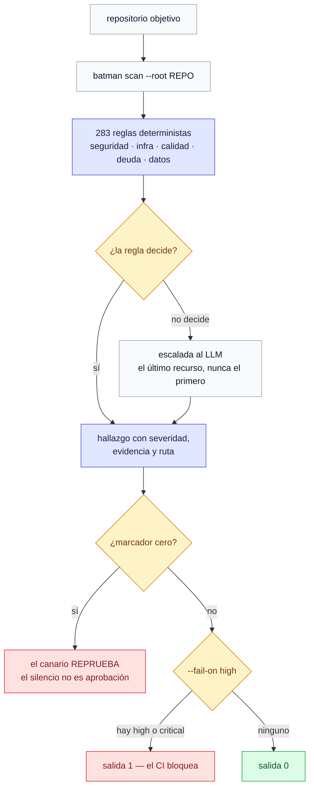
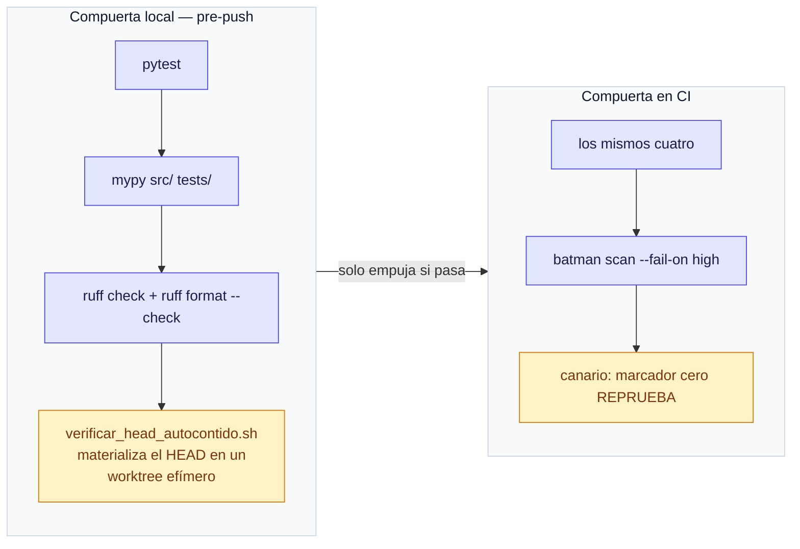

# Batman OS

[](https://github.com/rodrigogvieira98/batman-os/actions/workflows/ci.yml) [](LICENSE) 

**Gobernanza de ingeniería como sistema operativo.** 283 reglas deterministas que
auditan un repositorio entero — seguridad, infraestructura, calidad, deuda técnica,
datos — sin llamar a un modelo de lenguaje. El LLM entra al final, solo cuando la regla
determinista no decide.

🇧🇷 [Português](README.md) · 🇪🇸 **Español** · 🇺🇸 [English](README.en.md)

---

### ⚠️ Qué es este repositorio, y qué no es

Esta es una **vitrina curada**, no un espejo del repositorio de trabajo. La
diferencia importa para quien lee el código:

* **Lo que está aquí es el método**: la especificación (39 capítulos, 18 ADRs, 6
  adendas), el motor de scan con sus 283 specs de regla, el kernel, el runtime,
  las capabilities, la gobernanza de alerta y sus pruebas.
* **El monitor de infraestructura no se publica.** El sistema corre en
  producción contra una VPS real, cada 5 minutos, y el conjunto de reglas vivo
  lleva los **umbrales** — cuántas respuestas 404 caracterizan un barrido,
  cuántas rutas de sonda disparan alerta, qué reglas siguen en observación.
  Publicarlo sería publicar el mapa de cómo pasar por debajo del radar de esa
  máquina.
* **Lo que hay aquí de `observe/` es un corte del 2026-08-25** y no se mantiene:
  fue publicado antes de que la política anterior fuera escrita. Léelo como
  historia, no como lo que corre hoy.

El deploy, los runbooks, el backlog y el programa de respuesta a incidentes
también quedan fuera — un runbook saneado sigue enseñando la topología, y el
backlog narra incidentes reales con fecha.

*Actualizado el 2026-09-22.*


> "Un sistema inteligente no es el que responde todas las preguntas. Es el que reduce
> continuamente la cantidad de preguntas que hay que hacer."

| | |
|---|---|
| **176 commits**, autor único | **1.690 pruebas**, ejecutadas por el CI de este repositorio |
| **283 especificaciones** de regla | `mypy --strict` y `ruff` limpios, bloqueantes en CI |
| **39 capítulos** de especificación escritos antes del código | corre en producción contra un producto real, cada 5 minutos |

## Por qué esto no es un linter

Un linter responde *"¿esta línea está mal?"*. Batman OS responde *"¿este repositorio se
está desarrollando de una forma que va a fallar?"* — y trata su propia respuesta como
algo que puede estar mintiendo.



<sub>El LLM es el <b>último</b> paso, nunca el primero — y el canario corre antes del código de salida, porque <code>0 hallazgos</code> y <code>todo bien</code> son indistinguibles.</sub>

Dos defectos reales que el proyecto encontró **en sí mismo**, y las defensas que
nacieron de ellos:

**1. La compuerta no veía lo que se había commiteado.** `pytest`, `mypy` y `ruff` corren
sobre el *árbol de trabajo*. Un archivo importado por el código y nunca versionado pasa
los cuatro — y revienta en el primer clon limpio. Pasó dos veces. La defensa
(`scripts/verificar_head_autocontido.sh`) materializa el HEAD en un worktree efímero y
exige que `(tipos, especificaciones)` coincida con el árbol.

**2. "Cero hallazgos" y "todo bien" son indistinguibles.** Una ejecución en CI enumeró
1.382 archivos, reportó `0 hallazgo(s)` y salió con código 0 — porque el paquete se
publicó sin las 283 especificaciones, y un `glob` sobre un directorio inexistente no
lanza error. Una compuerta que solo mira el código de salida habría dado verde. La
defensa es un canario que **reprueba el marcador cero**: el silencio dejó de ser
aprobación.

Esa es la tesis del proyecto entero — **el fallo silencioso es el enemigo**. Un proceso
que se cuelga es peor que uno que descarta, porque el descarte aparece en el informe y
el cuelgue parece lentitud.



## Arquitectura de un vistazo

```
docs/spec/       especificación (39 capítulos, 10 volúmenes, 17 ADRs) — gana al código
                 en caso de divergencia, por regla explícita
src/batman_os/
  foundation/    tipos del glosario oficial (Mission, Capability, Operator, ...)
  kernel/        Mission Runtime, Planning/Decision/Workflow Engine, Event Bus, Scheduler
  runtime/       Capability/Execution Engine, Operational Memory (SQLite), concurrencia
  capabilities/  operadores, certificación, skills, tools — y las 283 reglas migradas
  workflow/      misiones formales, playbooks multi-paso, recuperación y fallback
  learning/      Knowledge Graph, evolución de regla/workflow, aprendizaje operacional
  governance/    Governance Engine, Human Review, escalada a LLM, observabilidad
  api/           API HTTP (FastAPI) — el tenant se deriva de la clave, nunca del cuerpo
tests/           1 archivo por capítulo, nombrado por los criterios de aceptación
```

**El aislamiento multi-tenant es estructural**, en lectura y en mutación — no un
`WHERE tenant_id` esparcido por las consultas. El tenant aplicado a una Misión viene
100% de la clave de API usada; no existe endpoint que acepte el tenant como campo del
payload.

## Ejecutar

```bash
python3.11 -m venv .venv
pip install -e ".[dev]"

pytest                                      # pruebas de aceptación
mypy src/
ruff check src/ tests/

batman scan --root <repo>                   # audita un repositorio real
batman scan --root <repo> --fail-on high    # salida 1 si hay hallazgo high/critical
```

> La especificación, la documentación y los comentarios están en portugués — es el
> idioma en que el sistema fue diseñado. Los identificadores de código (clases,
> funciones, variables) están en inglés. El [README en portugués](README.md) tiene el
> detalle completo: convenciones de nomenclatura, la API HTTP y la compuerta de CI.

---

<sub>MIT © 2026 Rodrigo Gomes Vieira</sub>
